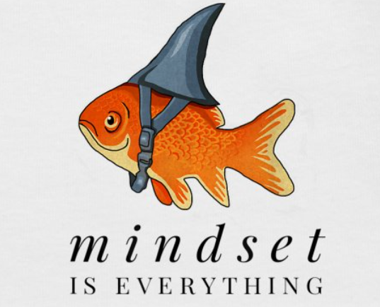

Think you might be in the wrong place? [Go home!](README.md)
### What grouth mindset means to me

Is to have your mind oriented to the learning process. This theory suggest a series of guidelines to help you keep a possitive and effective dispossition to learn. The key goal is to trust the process and you will be able to get to your goal.

### Always remember:

* Trust the process:
  
_It might not look like it right now, but you will get there if you keep going._

* Don't fear failure:
  
_Failure is a perfect opportunity to learn_

* Embrace the unknown:
  
>“I know of no time in human history where ignorance was better than knowledge.”

_-Neil deGrasse Tyson_